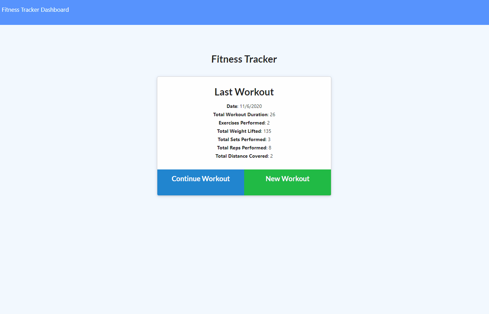

# Fitness-Tracker
[](https://www.mit.edu/~amini/LICENSE.md)
<br>
 A fitness tracker app to log your workouts. Can track both cardio and resistance workouts along with details about weight, reps, sets, distance, etc... 
There is a statistics page to analyze past workouts and trends.
 
 <br>




<br>

 ## Built With
* JavaScript
* MongoDB/Mongoose
* Express
* HTML
* CSS

## Dependencies
* [Mongoose](https://www.npmjs.com/package/mongoose)
* [Morgan](https://www.npmjs.com/package/morgan)
* [Express](https://www.npmjs.com/package/express)

## Installation
To install dependencies run
```
npm install
```

## Features
Workouts are stored with MongoDB. Saved data is displayed in an extensive statistics page about your previous workouts.
<br>


<br>

## Code Example
An example of the model used to store workouts. It contains the date, and array of exercise details, and a virtual tagged on to get the total workout duration.

<br>  

```javaScript

const workoutSchema = new Schema(
  {
    day: {
      type: Date,
      default: Date.now()
    },
    exercises:{
      type: Array,
      default: []
    }
  },
  {
    toJSON: {
      virtuals: true
    }
  } 
);

workoutSchema.virtual("totalDuration").get(function() {
  return this.exercises.reduce(function (total, exercise) {
      return total + exercise.duration;
    }, 0);
});

```

<br>
API Routes send data to and from the database and the client. 

<br>
<br>

```javaScript

var db = require("../models/workout");

module.exports = function(app) {
    //get all workouts
    app.get("/api/workouts", function (req, res) {
        db.find({}).then(function (workout) {
            res.send(workout);
         })
         .catch(function (err) {
           res.send(err);
         });
        });
    
    //create new workout
    app.post("/api/workouts", function (req, res) {
        db.create(req.body).then(function(data){
            res.send(data)
        })      
        });

        //update by workout id
    app.put("/api/workouts/:id", function(req,res){
        var id = req.params.id
        db.findByIdAndUpdate(id, {$push: {exercises: req.body}})
        .then(function(data){
            res.send(data)
        })
    });

    //get for stats page
    app.get("/api/workouts/range", (req,res) => {
        db.find({})
        .then(workout => {
          res.json(workout);
        })
        .catch(err => {
          res.json(err);
        });
      });
    
};

```

<br>
<br>

# Deployed Link:


# Repository Link:
https://github.com/joshglugatch/employee-summary-engine

<br>

### Author:
Josh Glugatch  

[](https://github.com/joshglugatch)
<br>
[](www.linkedin.com/in/joshua-glugatch)


